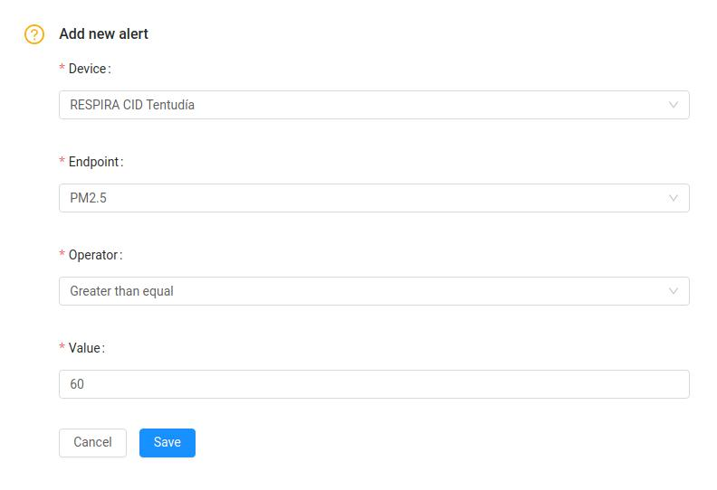

[< back to index](../../README.md)

# Alert panel

The alert panel provides a simple way to define and track alerts based on any public IoT value published by the RESPIRA platform. Only registered users can create alerts and visualize them from their accounts.

## Alert creation

Alerts can be created from _Alerts->Manager alerts_ and then press on _Add new alert_. The following form will open:

This form is quite self-explanatory but the idea is to set the reading of a given device to trigger the alert whenever its value  is greater or lower (operator field) than a threshold (value field). Alerts are continuously checked and reported in the _Alert console_:

At this point, the only way to navigate from the alert console to the specific device in the dashboard is to copy the id of the device from the alert console and then go to the dashboard.

