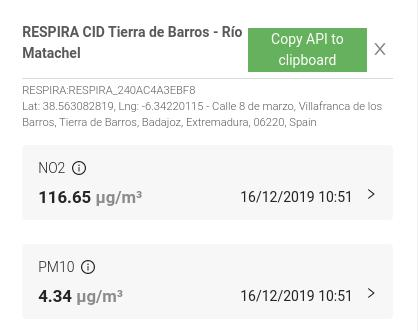

[< back to index](../../README.md)

# HTTP API

The HTTP API provides a way for programmers and specialists to download data from specific devices in a time range. An example of this API is provided for every device on the side panel:

<p align="center">

</p>

Clicking on _Copy API to clipboard_ on the above panel provides the following HTTP call:

```
http://calidadmedioambiental.org/api/v1/data/RESPIRA:RESPIRA_240AC4A3EBF8/2019-12-15T10:03:41/2019-12-16T10:03:41/json
```

Then it's simply a matter of modifying the call for our date and time range. Data can be downloaded in json and csv format, according to the API format:

```
http://calidadmedioambiental.org/api/v1/data/<Device profile>:<Device id>/<initial time>/<final time>/<format>
```

Being <format> either _json_ or _csv_

Time strings need to conform to the standard format: yyyy-mm-ddTHH:MM:SS

