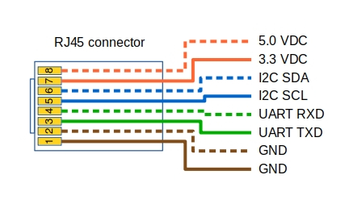

[< back to index](../../README.md)

# Index of contents

- [How to build your own RESPIRA FIWARE station](#how-to-build-your-own-respira-fiware-station)
- [Bills of materials](#bills-of-materials)
- [Assembly](#assembly)
- [Programming](#programming)
- [Joining a WiFi network](#joining-a-wiFi-network)
- [Connecting to RESPIRA environmental IoT platform](#connecting-to-respira-environmental-iot-platform)
- [Maintenance and calibration](#maintenance-and-calibration)

# How to build your own RESPIRA FIWARE station

The following are the official bills of materials used in this project. If you don't find the exact references of course you can use your own ones. Since the spirit of this project is totally open source, users can build this station in very different ways, add improvements and even replace the sensors by new references.

# Bills of materials

Users are invited to make their own PCB's based on the available schematics and gerbers.

## Microntroller board

| Reference | Description | Source |
|-----------|-------------|--------|
| U1 | 30-pin ESP32 NodeMCU board | e-bay, Amazon, Aliexpress, etc. |
| R1, R2 | 10kohm 1/6 W resistor | Mouser, Farnell, DigiKey, etc. |
| C1 | 1uF 10V ceramic capacitor | Mouser, Farnell, DigiKey, etc. |
| C2 | 100nF 10V ceramic capacitor | Mouser, Farnell, DigiKey, etc. |
| J1 | 2-pos 5mm-pitch screw connector | Mouser, Farnell, DigiKey, etc. |
| J4 | Molex 95503-2881 Vertical RJ45 connector | Mouser, Farnell, DigiKey, etc. |
| Enclosure | FIBOX TEMPO TAM131007 | RS, Farnell, etc. |

## Sensor board

| Reference | Description | Source |
|-----------|-------------|--------|
| SI7021 | SI7021 dual temperature and humidity sensor | e-bay, Amazon, Aliexpress, etc. |
| SPS30 | Sensirion particulate matter sensor | Mouser, Farnell, DigiKey, etc. |
| SPS30 connector | ZH 1.5mm JST 5-pole female connector | e-bay, Mouser, Farnell, Digikey, etc. |
| ES1-NO2-50 | NO2 sensor 0-50 ppm | ECSense, Pewatron |
| Enclosure | TFA-Dostmann 98.1114.02 | Amazon |
| Ethernet cable | 30 cm of CAT-6 8-pole Ethernet cable | Local store |
| Monopole wire | Coloured <=0.5mm monopole wire | Local store |

# Assembly

All parts have been selected to avoid any surface mount soldering (SMT). This means that anyone with a minimum experience in soldering electronic parts and owning a soldering iron should be able to assemble this station. The main microcontroller board is shown in the image below:

<p align="center">

</p>

As seen in the above picture, most of the complexity of the electronics is already included in the ESP32 development board. Apart from this main board, the MCU carrier board just needs a few passive components and connectors.

Assembling the sensor board is quite simple as well. Sensor units need to be connected to the auxiliary sensor board with wires. Finally, the sensor board is fixed into the pagoda-style enclosure and connected to the main microcontroller board by means of an Ethernet cable.

<p align="center">

</p>

Sensors need to be individually soldered to the sensor board by following this pinout:

<p align="center">

</p>

The following pinout diagram is recommended for the Ethernet cable:

<p align="center">

</p>

This image shows a complete RESPIRA FIWARE station completely assembled and connected. This station includes a Meanwel 5.0VDC power supply so that the whole electronics can be connected to AC mains:

<p align="center">

</p>

# Programming

The ESP32 is programmed from the [Arduino IDE](https://www.arduino.cc/). Before trying to compile the code, the following libraries need to be installed from _Sketch->Include library->Manager libraries_:

- [HTTPCLient library for ESP8266](https://github.com/esp8266/Arduino/tree/master/libraries/ESP8266HTTPClient).
- [Paul van Haastrecht's SPS30 library](https://github.com/paulvha/sps30).
- [tzapu's WiFiManager for ESP8266](https://github.com/tzapu/WiFiManager).
- [Sparkfun's SI7021 library](https://github.com/sparkfun/SparkFun_Si701_Breakout_Arduino_Library).
- [ArduinoOTA library](https://github.com/jandrassy/ArduinoOTA).

The source code needs to be modified with the correct API Key to connect your RESPIRA station to the FIWARE IoT agent. It you are connecting the station to our online platform then jump to [this section](#connecting-to-respira-environmental-iot-platform)

From [respira_fiware.ino](https://github.com/panStamp/respira_fiware/blob/master/arduino/respira_fiware/respira_fiware.ino):

```C++
const char FIWARE_SERVER[] = FIWARE_SERVER_IP_ADDRESS;
const uint16_t FIWARE_PORT = FIWARE_UL_PORT;
const char FIWARE_APIKEY[] = FIWARE_UL_API_KEY;
```

Finally, select the board _ESP32 Dev board_ from Arduino Tools->Boards, connect the ESP32 board to your computer via USB, select the right serial port and upload the code to the board. 

# Joining a WiFi network

The code integrates [WiFiManager](https://github.com/tzapu/WiFiManager), a popular Arduino library providing a simple web interface to help connect devices to existing WiFi networks. The first time a RESPIRA station is powered on, it deploys a basic WiFi access point with name "RESPIRA_XXXXXXXXXXXX", being "XXXXXXXXXXXX" the MAC address of the ESP32 module. This access point is also deployed after trying to connect to a precedent WiFi network without success. Once WiFiManager is running we need to follow these steps:

1- Connect to the "RESPIRA_XXXXXXXXXXXX" WiFi network from a cell phone
2- Open the web page http://192.168.4.1. The following interface will appear on the screen:

<p align="center">

</p>

3- Press on the "Configure WiFi" button
4- Fill SSID and password
5- Save the settings and let the hardware restart

# Connecting to RESPIRA environmental IoT platform

Connecting new RESPIRA FIWARE stations to [RESPIRA environmental IoT platform](RESPIRA_PLATFORM.md) is very simple. Once logged into your Environmental Open Labs account you need to create a new device profile and select _RESPIRA FIWARE station_ from the wizard. The platform will return a new API key for this device profile which will have to be entered into the Arduino code.

Once into the Arduino code, set the API key and leave the rest of FIWARE constants unmodified:

```C++
const char FIWARE_SERVER[] = FIWARE_SERVER_IP_ADDRESS;
const uint16_t FIWARE_PORT = FIWARE_UL_PORT;
const char FIWARE_APIKEY[] = FIWARE_UL_API_KEY;
```

# Maintenance and calibration

RESPIRA stations need to be periodically maintained. [This guide](RESPIRA_CALIBRATION.md) provides some tips about where to install your stations and how to maintain them up to date.


