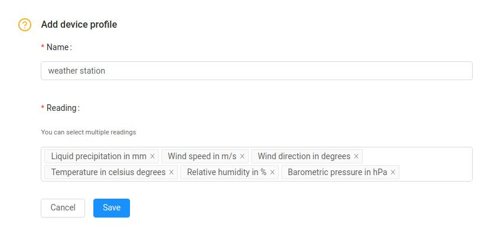

[< back to index](../../README.md)

# Index of contents

- [Create account](#create-account)
- [Create device profile](#create-device-profile)
- [Create device](#create-device)

# Create account

Although _RESPIRA environmental IoT platform_ can be freely viewed and browsed without the need to be registered, registered accounts can also create devices and transmit IoT data to the platform. If you got to this tutorial is probably because you want to connect your IoT device to _RESPIRA environmental IoT platform_. In this case, please proceed to create an account from [here](http://calidadmedioambiental.org).

# Create device profile

Device profiles are types of devices with a documented set of readings (inputs or endpoints). When you create a new device you need to associate it to a specific device profile. Thus, before creating your first device you have to define how many endpoints this device will have and how they will perform.

Let's say we want to create a weather station that we want to connect to the platform. We have then to create a new device profile from _Device->Device profiles->Add device profile_ as follows:

<p align="center">

</p>

Once the device profile has been created we need to take the API Key from the Device Profile list. This key corresponds to the FIWARE API key for the UltraLight (UL) IoT agent. By clicking on the eye icon an example of UltraLight frame is displayed. We can use this example in our source code. The convention of the variable nomenclature needs to be followed according to the example returned by the platform. Otherwise, the platform would not be able to identify the nature of the readings received.

Example of UL frame: 

```
t|25.00#h|40.00
```
Where t means temperature and h humidity. The precedent UltraLight frame would translate into the following Arduino code:

```C++
sprintf(txBuf, "t|%.2f#h|%.2f", temperature, humidity);
```

_txBuff_ will need to be transmitted as payload via HTTP post to the UL agent of _RESPIRA environmental IoT platform_. The destination URL for the transmission is also included in the example returned by the device profile manager.

# Create device

Once our first device profile is configured we can create a new device. This tutorial does not cover the process related to the development of the embedded code. You can however use the [source code](https://github.com/panStamp/respira_fiware/tree/master/arduino/respira_fiware) of the RESPIRA station as a basis for your developments.

Devices are automatically created upon reception of the first UL frame. The UltraLight transmission needs to be done against a known API Key. Each API Key corresponds to a specific device profile so every time an UL frame is received, data is interpreted according to a specific device profile.

In order to create a new device you need to program your electronic board and transmit an UL frame with the right API key. The RESPIRA platform will then receive the UL frame and will initialize the device in the database for you. Once the device has been automatically created by the platform we can edit it with the corresponding name, description and location.

<p align="center">

</p>

It's important to add the right location for the device since this will place the device on the map.

