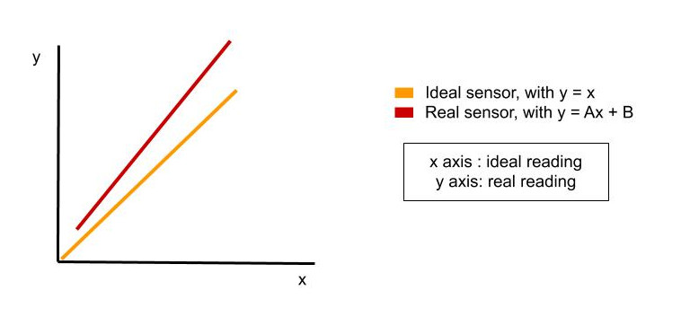
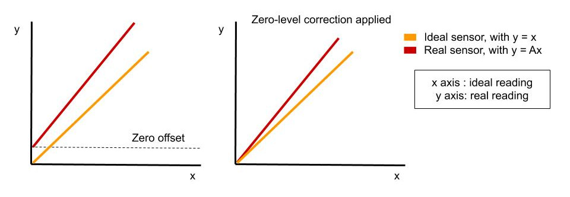

[< back to index](../../README.md)

# Index of contents

- [Calibration of RESPIRA](#calibration-of-respira)
- [Previous tests and calculations](#previous-tests-and-calculations)
- [Correction mechanisms](#correction-mechanisms)

# Calibration of RESPIRA

RESPIRA, like any other environmental station, is based on sensors whose performance gets worse over time. Sensor degradation depends of course on the quality of sensors but also on temperature, moisture, presence of dirt and the concentration of pollution there where the sensor is installed. Sensors in very polluted environments typically need to be recalibrated more often than sensors in cleaner environments.

SPS30 and ES1-NO2 can be considered as low-cost sensors but both provide a decent response in terms of accuracy and drift. Of course, they can not compete against official air quality stations but they do perform nicely if you take the following suggestions into consideration:

- Install the station totally protected against direct sunlight. Electronics do not like high temperatures. Moreover, this will also avoid drastic temperature changes that might affect readings.
- Avoid highly polluted environments since sensors rapidly wear out and maintenance becomes more complicated. Environments with high concentrations of pollutants typically need to be monitored with heavy air quality stations. These stations usually need weekly or even daily maintenance.
- Protect the station against heavy wind and rain. The pagoda-style enclosure where the sensors are located can support vertical and inclined rain but not horizontal projections of water. This enclosure has not either been tested under strong wind.
- Check the output of the station against other sources over time. You can use another newer station for instance, before its final installation.
- Don't get mad for little discrepancies between stations and readings. Anything under 80 ug/m3 for the NO2 readings and 30 ug/m3 for the particulate matter sensor are perfectly acceptable.
- Check the WiFi connection before installing the station. This may save you some troubles.

# Previous tests and calculations

We can analyze the state of a sensor by comparing ideal performance against real performance. An ideal sensor would provide a nice graph where Y (real reading) = X (ideal reading) whilst a real sensor includes an offset (B) and a parasite gain (A). The following chart shows both scenarios:

<p align="center">

</p>

In order to get A and B from a real sensor we would need at least two real measurement points. This can be done in a laboratory or in the field by means of external gas injectors. Longer tests can also be run in parallel against newer stations or any other calibrated equipment, as stated before. New ECS-NO2 sensors are factory calibrated and can be used to recalibrate older stations. Once A and B have been calculated we can then apply corrections in the sensor as explained later in this document.

# Correction mechanisms

The Arduino code contains two mechanisms to compensate for sensor drift. The first method relies on simple factor (gain) and offset compensation so it's a matter of applying A and B calculated in the precedent step. The code also includes an automatic zero-level calibration for both the NO2 and the particulate matter sensor. The station continuously saves the lowest value measured for every polluant within the last 10 days. Enabling this method on the station takes the minimum value as a correction offset that is then applied every 10 days. The following image shows how the minimum value registered within a period of time can be used to zero-compensate readings:

<p align="center">

</p>

Zero-level corrections assume that the lowest reading registered corresponds to what it should be 0 ug/m3 so please consider whether your station is eligible for this strategy before enabling it. This technique is only valid there where concentrations have proven to go down to (almost) zero at least once in 10 days. Stations installed in areas where pollution is always present and never go down to near zero should not rely on automatic zero-level calibration. Instead, manual factor-offset corrections should be periodically applied.

## Remote calibration

The RESPIRA project includes RESPIRA tool, a Python command-line program made to send calibration settings to FIWARE. RESPIRA stations request calibration information from FIWARE before transmitting pollution values. These settings are then applied starting from the next transmission, one hour later.

The following command sends calibration factor (A) = 1.0021 and offset (B) = -12.687 for the NO2 readings and the station with ID RESPIRA_XXXXXXXXXXXX:

```
python3 respira_tool.py --calibrate no2 -d RESPIRA_XXXXXXXXXXXX -f 1.0021 -o -12.687
```

[This page](RESPIRA_TOOL.md) explains all the necessary about RESPIRA tool regarding the remote configuration of stations.


