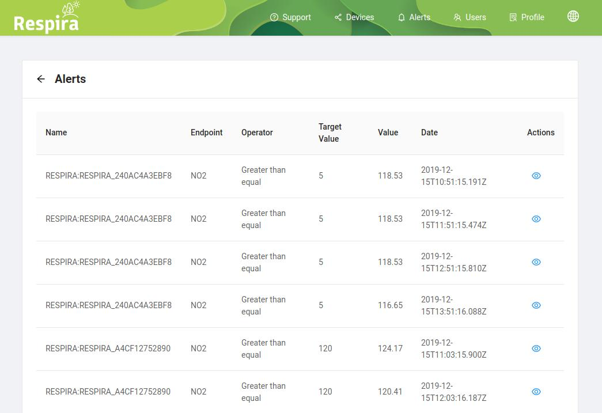

[< índice](INDEX.md)

# Panel de alertas

El panel de alertas proporciona una manera sencilla de crear y visualizar alertas en base a valores IoT de la plataforma RESPIRA. Sólo usuarios registrados pueden crear alertas y consultarlas desde sus respectivas cuentas.

## Alert creation

Creamos nuevas alertas desde _Alertas->Gestionar alertas_ y luego pulsamos sobre el botón _Añadir nueva alerta_. El siguiente formulario debe aparecer:

El formulario es suficientemente autoexplicativo pero la idea básica es la de seleccionar una lectura de un dispositivo específico y progrmaar la alerta para que se dispare cuando esta lectura sobrepasa o desciende (campo operador) de un determinado valor límite (campo valor). Las alertas son continuamente evaluadas y reportadas en la _Consola de alertas_:

Llegados a este punto, para visualizar el dispositivo en el dashboard principal tenemos que copiar el id del dispositivo desde la consola de alertas y realizar la búsqueda en el dashboard.

