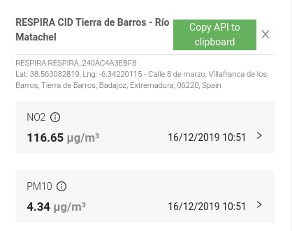

[< índice](../../README.md)

# API HTTP

La API HTTP ofrece a programadores y especialistas una manera de descargar datos de dispositivos específicos dentro del rango de fechas y horas deseado. Desde el panel lateral de cada dispositivo podemos encontrar un ejemplo de llamada a la API:

<p align="center">

</p>

En concreto y para este dispositivo encontramos la siguiente llamada la hacer click sobre el botón _Copiar API URL_:

```
http://calidadmedioambiental.org/api/v1/data/RESPIRA:RESPIRA_240AC4A3EBF8/2019-12-15T10:03:41/2019-12-16T10:03:41/json
```

Para personalizar la llamada basta con cambiar algunos de los campos de ésta, de acuerdo con el siguiente formato de llamada:

```
http://calidadmedioambiental.org/api/v1/data/<Device profile>:<Device id>/<initial time>/<final time>/<format>
```

Siendo <format> bien _json_ o _csv_, marcando así el formato de descarga de los datos.

El formato de las fechas debe seguir el siguiente estándar: yyyy-mm-ddTHH:MM:SS

