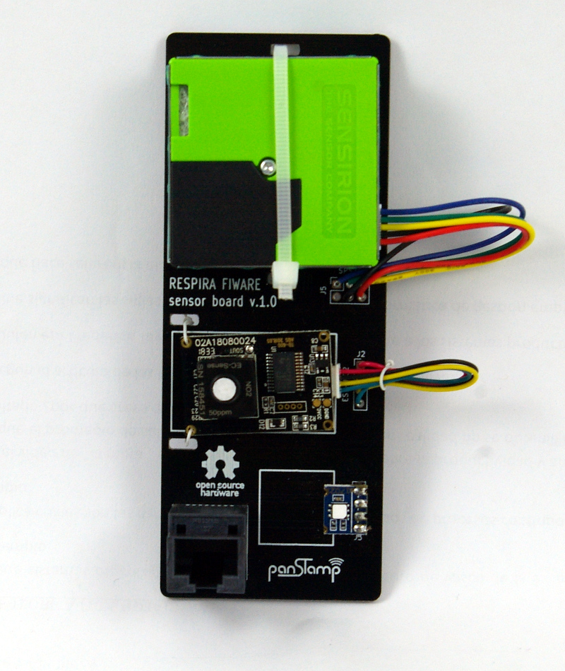
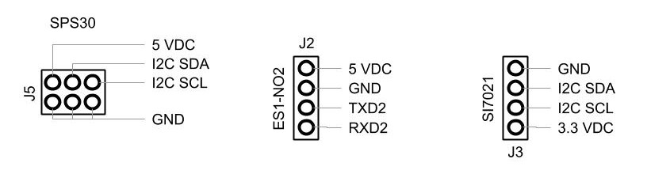
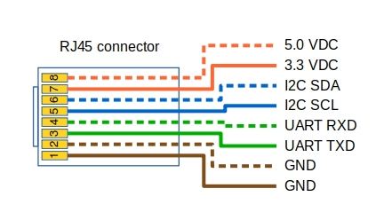
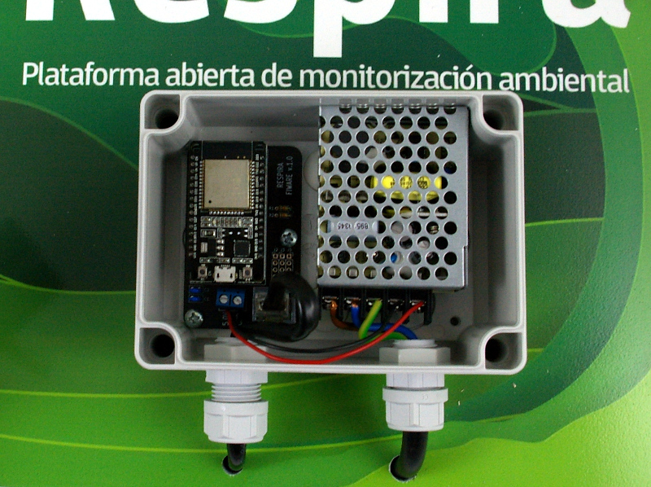
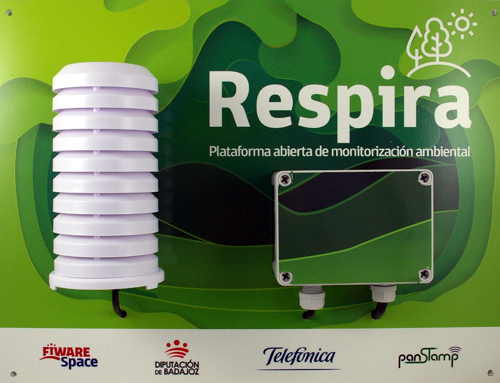

[< índice](../../README.md)

# Índice de contenidos

- [Cómo montar su propia estación RESPIRA](#cómo-montar-su-propia-estación-respira)
- [Lista de materiales](#lista-de-materiales)
- [Ensamblaje](#ensamblaje)
- [Programación](#programación)
- [Conexión a una red WiFi](#conexión-a-una-red-wifi)
- [Conexión a la plataforma RESPIRA](#conexión-a-la-plataforma-respira)
- [Mantenimiento y calibración](#mantenimiento-y-calibración)

# Cómo montar tu propia estación RESPIRA

Se expone a continuación la lista oficial de materiales necesaria para la construcción de una estación RESPIRA. Si no encuentra las referencias exactas puede sustituirlas por otras de similares prestaciones. Puesto que el espíritu de este proyecto es totalmente abierto (open source), se invita a los usuarios a montar estaciones de múltiples formas así como a aportar mejoras y a reemplazar sensores por nuevas referencias.

# Lista de materiales

Se invita a los usuarios a hacer sus propios circuitos impresos a partir de los ficheros gerber puestos a disposición desde el proyecto.

## Tarjeta microcontroladora

| Referencia | Descripción | Fuente |
|-----------|-------------|--------|
| U1 | 30-pin ESP32 NodeMCU board | e-bay, Amazon, Aliexpress, etc. |
| R1, R2 | 10kohm 1/6 W resistor | Mouser, Farnell, DigiKey, etc. |
| C1 | 1uF 10V ceramic capacitor | Mouser, Farnell, DigiKey, etc. |
| C2 | 100nF 10V ceramic capacitor | Mouser, Farnell, DigiKey, etc. |
| J1 | 2-pos 5mm-pitch screw connector | Mouser, Farnell, DigiKey, etc. |
| J4 | Molex 95503-2881 Vertical RJ45 connector | Mouser, Farnell, DigiKey, etc. |
| Caja | FIBOX TEMPO TAM131007 | RS, Farnell, etc. |

## Tarjeta de sensorización

| Referencia | Descripción | Fuente |
|-----------|-------------|--------|
| SI7021 | SI7021 dual temperature and humidity sensor | e-bay, Amazon, Aliexpress, etc. |
| SPS30 | Sensirion particulate matter sensor | Mouser, Farnell, DigiKey, etc. |
| SPS30 connector | ZH 1.5mm JST 5-pole female connector | e-bay, Mouser, Farnell, Digikey, etc. |
| ES1-NO2-50 | NO2 sensor 0-50 ppm | ECSense, Pewatron |
| Caja | TFA-Dostmann 98.1114.02 | Amazon |
| Cable ethernet | 30 cm of CAT-6 8-pole Ethernet cable | Local store |
| Cable monopolo | Coloured <=0.5mm monopole wire | Local store |

# Ensamblaje

Todos los componentes han sido seleccionados con el fin de simplificar al máximo el proceso de ensamblaje y de soldadura. De este modo, al utilizar componentes con patillas (THT) se evita cualquier tipo de soldadura superficial (SMT) de forma que cualquier aficionado que posea un soldador y estaño puede construir su propia estación en cuestión de un par de horas.

La siguiente imagen muestra la tarjeta microncotroladora totalmente ensamblada:

<p align="center">

</p>

Como se aprecia en la imagen, toda la complejidad del diseño descansa en el módulo ESP32 de desarrollo. A parte de este módulo, la placa base apenas contiene unos pocos componentes pasivos y conectores.

El proceso de ensamblaje de la tarjeta de sensorización es también bastante sencillo. Los sensores se conectan a la tarjeta base auxiliar por medio de cables. Finalmente, la tarjeta queda fijada en el interior de la caja con forma de pagoda que protege a la electrónica de la lluvia. Tarjeta de sensorización y tarjeta microcontrolada quedan unidas por medio de un cable ethernet.

<p align="center">

</p>

Los sensores se conectan a la tarjeta siguiendo este esquema de pines

<p align="center">

</p>

Se recomienda también la siguiente distribución de hilos para el cable ethernet si bien cualquier cable ethernet paralelo (el estándar) sirve para la aplicación.

<p align="center">

</p>

Finalmente, se muestra un par de imágenes de una estación RESPIRA completamente ensamblada. Esta estación incluye una fuente de alimentación Meanwel de 5.0VDC de forma que el dispositivo al completo puede ser alimentado desde 230VAC.

<p align="center">

</p>

<p align="center">

</p>

# Programación

El módulo ESP32 se programa desde el entorno de programación [Arduino IDE](https://www.arduino.cc/). Pero antes de intentar compilar el código, tenemos que asegurar que la siguiente lista de librerías queda instalada desde _Sketch->Include library->Manager libraries_:

- [Librería SPS30 de Paul van Haastrecht](https://github.com/paulvha/sps30). Esta librería debe ser instalada de forma manual.
- [WiFiManager para ESP32](https://github.com/zhouhan0126/WIFIMANAGER-ESP32). Esta librería debe ser instalada de forma manual.
- [Librería SI7021 de Sparkfun](https://github.com/sparkfun/SparkFun_Si701_Breakout_Arduino_Library). Esta librería puede ser instalada desde el gestor de librerrías de Arduino.
- [Librería ArduinoOTA](https://github.com/jandrassy/ArduinoOTA). Esta librería puede ser instalada desde el gestor de librerrías de Arduino.

Durante la compilación es probable que se den algunos conflictos en las librerías instaladas con respecto a los cores del ESP32. Recomendamos pues hacer un par de cambios:

Abrir el directorio que contiene las librerías de Arduino y editar sps30/sps30.h. aquí tendremos que comentar INCLUDE_SOFTWARE_SERIAL.

```C++
//#define INCLUDE_SOFTWARE_SERIAL 1
```

Tras esto debemos abrir WIFIMANAGER-ESP32/WiFiManager.h y renombrar HTTP_HEAD con un nombre distinto, como por ejemplo HTTP_HEADER:

```C++
const char HTTP_HEADER[] PROGMEM = ....
```

Y también renombrar todas las referencias a HTTP_HEAD en WIFIMANAGER-ESP32/WiFiManager.h.

Una vez finalizados estos cambios podemos por fin abrir el proyecto respira_fiware que se encuentra en el directorio arduino dentro del [repositorio](https://github.com/panStamp/respira_fiware). El código fuente ha de ser modificado con la dirección IP del servidor FIWARE, el puerto UltraLight y la API key que permite conectar la estación RESPIRA al agente IoT. Si pretende conectar la estación a nuestra plataforma IoT vaya directamente a [esta sección](#conexión-a-la-plataforma-respira)

En [respira_fiware.ino](https://github.com/panStamp/respira_fiware/blob/master/arduino/respira_fiware/respira_fiware.ino):

```C++
const char FIWARE_SERVER[] = FIWARE_SERVER_IP_ADDRESS;
const uint16_t FIWARE_PORT = FIWARE_UL_PORT;
const char FIWARE_APIKEY[] = FIWARE_UL_API_KEY;
```

Por último, debemos seleccionar _ESP32 Dev board_ en el desplegable Tools->Boards de Arduino, conectar la tarjeta ESP32 a la computadora por USB, seleccionar el puerto serie y programar la tarjeta. 

# Conexión a una red WiFi

El código integra [WiFiManager](https://github.com/tzapu/WiFiManager), una popular librería de Arduino que permite seleccionar la red WiFi a la que queremos que se conecte nuestro ESP32 por medio de una página web embebida. La primera vez que la estación RESPIRA es alimentada, ésta despliega un punto de acceso con SSID "RESPIRA_XXXXXXXXXXXX", siendo "XXXXXXXXXXXX" la dirección MAC del módulo ESP32. Este punto de acceso es también desplegado al intentar conectar a una red WiFi anterior sin éxito. Con el punto de acceso del ESP32 en marcha basta con seguir estos pasos:

1- Conectar a la red WiFi "RESPIRA_XXXXXXXXXXXX" desde un teléfono móvil.
2- Abrir la página web http://192.168.4.1. El siguiente interfaz se mostrará en pantalla:

<p align="center">

</p>

3- Pulsar sobre el botón "Configure WiFi"
4- Rellenar los campos SSID y password
5- Salvar la configuración y reiniciar la tarjeta.

# Conexión a la plataforma RESPIRA

El proceso de conexión de cualquier estación RESPIRA FIWARE a la [plataforma IoT medioambiental RESPIRA](RESPIRA_PLATFORM.md) es muy simple. Una vez registrado en la plataforma basta con visualizar los detalles del perfil de dispositivo RESPIRA ya creado en la cuenta. Dentro de estos detalles aparece el API key que debe ser incluído en la programación del dispositivo electrónico, así como la dirección IP del servidor FIWARE y el puerto UltraLight de la aplicación.

Dentro del código, tenemos que cambiar la API key y dejar el resto de parámetros en sus valores por defecto:

```C++
const char FIWARE_SERVER[] = "calidadmedioambiental.org";
const uint16_t FIWARE_PORT = 80;
const char FIWARE_APIKEY[] = FIWARE_UL_API_KEY;
```

# Mantenimiento y calibración

Las estaciones RESPIRA requiren de mantenimiento y de calibración periódicos. [Esta guía](RESPIRA_CALIBRATION.md) proporciona algunas pistas sobre cómo y dónde instalar las estaciones y de cómo mantenerlas correctamente.


