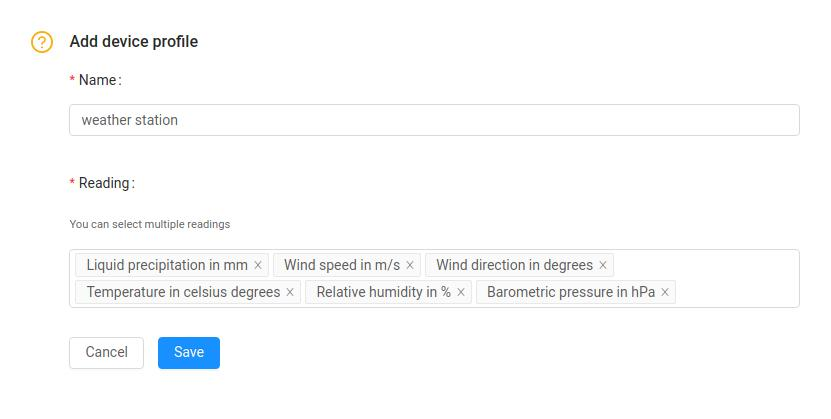
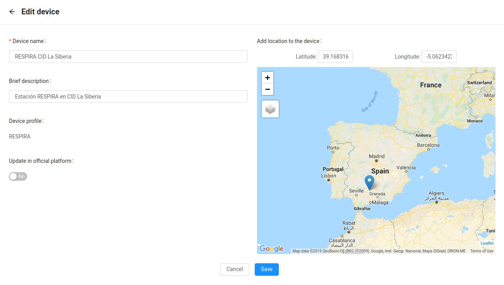

[< back to index](../../README.md)

# Índice de contenidos

- [Creación de cuenta](#creación-de-cuenta)
- [Creación de perfil de dispositivo](#creación-de-perfil-de-dispositivo)
- [Creación de dispositivos](#creación-de-dispositivos)

# Creación de cuenta

La plataforma IoT RESPIRA es de libre acceso y puede ser consultada por cualquier usuario sin necesidad de registrarse. Sin embargo, el registro sí es necesario en el caso en el que se desee crear dispositivos y darlos de alta en la aplicación. Si desea realizar ésta y otras operaciones en la plataforma le invitamos a que se registre en [este enlace](http://calidadmedioambiental.org).

# Creación de perfil de dispositivo

Los perfiles de dispositivo son estructuras de datos que contienen lecturas (entradas o endpoints). Cuando se crea un dispositivo y empieza a transmitir, éste debe venir asociado a un determinado perfil de dispositivo. De este modo, antes de poner en marcha un dispositivo se hace necesario definir un nuevo perfil de dispositivo o bien acogerse a uno de los perfiles ya disponibles. El perfil de dispositivo define el número y tipo de lecturas proporcionadas por el dispositivo.

Supongamos que queremos conectar una estación meteorológica a la plataforma. Necesitamso entonces definir un perfil de dispositivo que contenga todas y cada una de las lecturas proporcionadas por la estación. Para crear un nuevo perfil debemos acceder desde la plataforma en _Dispositivos->Perfiles de dispositivo->Añadir perfil de dispositivo_.

<p align="center">

</p>

Una vez creado el perfil de dispositivo debemos copiar la API Key disponible en el listado de perfiles. Esta clave corresponde con la API Key del agente UltraLight (UL) FIWARE. Haciendo click sobre el icono del ojose despliega un ejemplo de trama UltraLight que podemos usar en el código fuente de nuestra estación meteorológica. La nomenclatura UL de las variables presentado en el ejemplo devuelto por la plataforma debe ser respetado. De otro modo, la plataforma no sabría identificar la naturaleza de las lecturas.

Ejemplo de trama UltraLight para un sensor de temperatura y humedad:

```
t|25.00#h|40.00
```

Donde t corresponde a la lectura de la temperatura y h a la de humedad. La trama UltraLight anterior se traduciría por ejemplo a código Arduino de la siguiente forma:

```C++
sprintf(txBuf, "t|%.2f#h|%.2f", temperature, humidity);
```

_txBuff_ sería entonces el contenido del paquete (payload) que deberá ser transmitido a la plataforma IoT vía HTTP POST. En el ejemplo devuelto por el gestor de perfiles de dispositivo se incluye asímismo la URL contra la que realizar la transmisión.

# Creación de dispositivos

Una vez creado un primer perfil de dispositivo estamos por fin en disposición de trabajar sobre nuestro dispositivo. Este tutorial no cubre todo lo relativo al desarrollo del código fuente del dispositivo. Pare esto último pueden consultar el [código fuente](https://github.com/panStamp/respira_fiware/tree/master/arduino/respira_fiware) de la estación RESPIRA.

Los dispositivos son descubiertos por la plataforma y generados de forma automática en ésta tras recibir las primeras transmisiones UltraLight por parte del dispositivo. Es por esto que el dispositivo ha de transmitir con la API Key designada por la plataforma. Cada API Key corresponde a un perfil de dispositivo, de forma que cada transmisión UltraLight queda asociadad a un perfil en concreto y de este modo la plataforma es capaz de decodificar la información.

Una vez nuestro dispositivo ha sido puesto en marcha y ha realizado la primera transmisión, la plataforma IoT RESPIRA dará de alta el dispositivo en el listado _Dispositivos->Mis dispositivos_. El dispositivo será identificable por su ID, que corresponde al introducido en el código fuente de la electrónica. Llegados a este punto podemos editar nuestro recién creado dispositivo desde el panel de dispositivos, otorgándole un nombre, una descripción y una ubicación que ayuden a a otros usuarios a identificar el dispositivo en la plataforma.

<p align="center">

</p>

