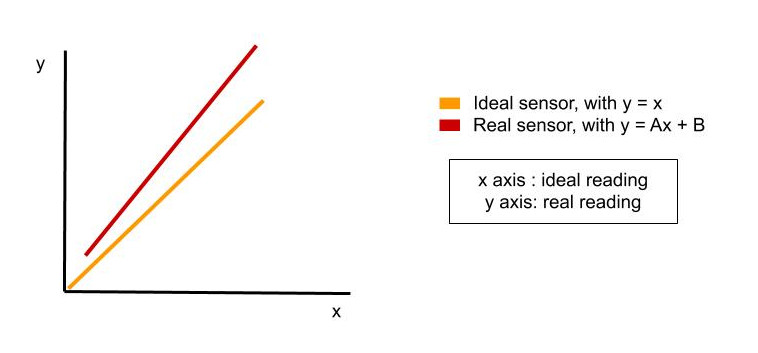

[< índice](INDEX.md)

# Índice de contenidos

- [Calibración de RESPIRA](#calibracion-de-respira)
- [Tests y cálculos previos](#tests-y-calculos-previos)
- [Mecanismos de corrección](#mecanismos-de-correccion)
- [Calibración remota](#calibracion-remota)

# Calibración de RESPIRA

RESPIRA, como cualquier otra estación de monitorización medioambiental, está basada en sensores cuyo comportamiento empeora con el paso del tiempo. La degradación de este comportamiento depende por supuesto de la calidad del sensor pero también depende de las temperaturas soportadas, de la presencia de humedad, de suciedad y de las concentraciones de contaminantes a los que es sometido. Sensores en entornos altamente contaminados requieren de recalibración con mayor periodicidad que aquellos sensores que funcionan en entornos poco contaminados.

SPS30 y ES1-NO2 pueden ser considerados como sensores de bajo coste, si bien ambos sensores proporcionan una respuesta bastante decente en términos de precisión y de deriva. Es obvio que estos sensores no pueden competir con sensores presentes en las estaciones oficiales pero pueden llegar a ofrecer prestaciones bastante buenas siempre y cuando se respeten las siguientes recomendaciones:

- Instalar la estación protegida de la incidencia directa de los rayos del sol. Las altas temperaturas son perjudiciales para el buen funcionamiento de la electrónica y de paso evitamos los cambios bruscos de temperatura, que afectan negativamente a las lecturas de concentración de contaminantes.
- Evitar entornos con mucha contaminación puesto que los sensores pueden llegar a degradarse rápidamente y su mantenimiento se complica. Los entornos con altos niveles de contaminación necesitan de estaciones pesadas de monitorización del aire. Estas estaciones son típicamente mantenidas de forma diaria o semanal.
- Proteger las estaciones de fuertes lluvias. La caja tipo pagoda que alberga los sensores puede soportar lluvias verticales pero no proyecciones horizontales de agua. Esta caja no ha sido probada en situaciones de fuerte viento.
- Cotejar periódicamente las lecturas porporcionadas por la estación RESPIRA con otras fuentes. Puede usarse como fuente de referencia una estación RESPIRA nueva, antes de ser instalada en su ubicación final.
- No debemos sorprendernos si observamos discrepancias entre estaciones y lecturas. Diferencias que ronden los 80 ug/m3 en las lecturas de NO2 y 30 ug/m3 en las lecturas de concentración de partículas es perfectametne asumible.
- Comprobar la conexión WiFi antes de instalar la estación. Esto nos evitará algún que otro problema.

# Tests y cálculos previos

Podemos analizar el comportamiento de un sensor al compararlo con su comportamiento ideal. Un sensor ideal ofrecería un comportamiento modelizado por una bonita línea donde Y (lectura real) = X (lectura ideal) mientras que un sensor real incluiría un offset (B) y una ganancia parásita (A). La siguiente gráfica muestra ambos escenarios:

<p align="center">

</p>


Para obtener los valores de A y B necsitamos al menos dos puntos reales de medida contrastados. Estas medidas pueden realizarse en un laboratorio o sobre el terreno por medio de inyectores de gas específicos para uso en calibración. También pueden llevarse a cabo tests de larga duración dejando instrumental calibrado o una estación RESPIRA nueva (calibrada de fábrica) junto a la estación a calibrar, tal y como se comentaba en la sección anterior.


# Mecanismos de corrección


El código Arduino incluye dos mecanismos para compensar la deriva de los sensores. El primer método se basa en la aplicación de un factor o ganancia y un offset que corrigen la lectura. En este caso basta con aplicar A y B calculados en el paso anterior. El código fuente también incluye un método de compensación automática por corrección del nivel cero de lectura. Este método es aplicable tanto al sensor de NO2 como al de partículas. En este caso la estación almacena el valor mínimo de lectura realizado en los últimos 10 días. Transcurrido este tiempo, la estación toma este mínimo como el nuevo valor cero. Usamos pues el valor mínimo como offset de corrección cada 10 días. La siguiente imagen muestra como el valor mínimo registrado es utilizado para realizar la compensación por nivel cero comentada:

<p align="center">

</p>

La compensación por nivel zero asume que la menor de las lecturas realmente corresponde a la concentración de 0 ug/m3, de forma que antes de habilitar este mecanismo de compensación se hace necesario decidir si la estación es realmente elegible para esta política. Esta técnica es sólo válida allí donde se demuestra que las concentraciones de contaminantes descienden hasta niveles de casi cero en el periodo de 10 días. Estaciones ubicadas en áreas con contínua contaminación y que nunca desciende a niveles de casi cero no deberían apoyarse en este tipo de compensación. En las situaciones de contaminación continuada deberíamos realizar compensaciones manuales basadas en el método del factor-offset.

## Calibración remota

El proyecto RESPIRA incluye la herramienta _RESPIRA tool_, un programa en línea de comando desarrollado en Python para transmitir parámetros de calibración a FIWARE. Toda estación RESPIRA consulta con el Context-Broker FIWARE la existencia de tales parámetros, usándolos antes de posteriores transmisiones (una hora más tarde) para corregir lecturas y activar calibraciones en el propio dispositivo.

El siguiente comando transmite factor de calibración (A) = 1.0021 y offset (B) = -12.687 aplicables a las lecturas de NO2 de la estación con ID RESPIRA_XXXXXXXXXXXX:

```
python3 respira_tool.py --calibrate no2 -d RESPIRA_XXXXXXXXXXXX -f 1.0021 -o -12.687
```

[Esta página](RESPIRA_TOOL.md) explica todo lo necesario sobre la utilidad _RESPIRA tool_ en lo que respecta a la configuración remota de estaciones.


