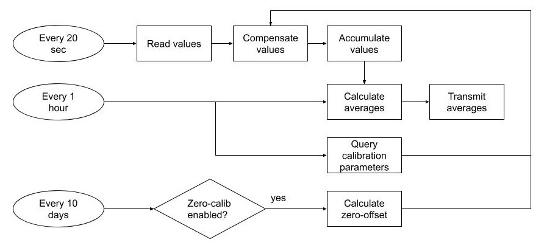

[< índice](INDEX.md)

# Índice de contenidos

- [La estación RESPIRA FIWARE](#la-estacion-RESPIRA-FIWARE)
- [Especificaciones](#especificaciones)
- [Funcionamiento](#funcionamiento)
- [Componentes](#componentes)
  - [Microcontrolador](#microcontrolador)
  - [Sensores](#sensores)

# La estación RESPIRA FIWARE

La arquitectura del hardware RESPIRA es bastante sencilla. Un módulo ESP32 actúa como el cerebro de la estación medioambiental. Por otra parte, la lectura de temperatura ambiente, humedad relativa y concentraciones de NO2 y de partículas (PM) es proporcionada desde tres sensores independientes vía I2C y UART. El SoC ESP32 tiene suficiente espacio en flash y potencia para almacenar y procesar las lecturas internamente con el fin de limpiar y filtrar los datos y de ejecutar rutinas de calibración periódicas. Por último, la información procesada es transmitida a la plataforma FIWARE por medio de una [petición HTTP UltraLight 2.0](https://fiware-iotagent-ul.readthedocs.io/en/latest/usermanual/index.html).

# Especificaciones

- Parámetros proporcionados: Temperatura ambiente, humidity relativa, NO2, PM1.0, PM2.5, PM4.0, PM10, tamaño típico de partículas y [CAQI](https://en.wikipedia.org/wiki/Air_quality_index#CAQI)
- Alimentación : 5.0VDC
- Corriente máxima : 300 mA
- Comunicación : WiFi 2.4GHz
- Protocolo FIWARE: UltraLight 2.0 HTTP

# Funcionamiento

Toda estación RESPIRA recoge datos medioambientales cada 20 segundos. Estos datos son almacenados para realizar una media aritmética cada hora e inmediatamente transmitir estas medias hacia la plataforma. Las estaciones RESPIRA transmiten pues valores medios cada hora.

Por otra parte, las estaciones RESPIRA también realizan compensaciones internas de las lecturas en temperatura y también otras rutinas de compensación explicadas [aquí](RESPIRA_CALIBRATION.md).

# Componentes

RESPIRA FIWARE está formado por dos partes principales. La primera parte es la unidad microcontrolada, el cerebro de la solución que contiene el módulo ESP32 con las comunicaciones WiFi. La segunda parte es el bloque de sensorización, contenido dentro de un encapsulado con formato pagoda que garantiza la ventilación. Ambas partes comunican entre sí por medio de I2C y UART.

## Microcontrolador

Esta tarjeta usa exclusivamente componentes "con patas" (THT) con el fin de facilitar su montaje y de permitir su prototipado desde la comunidad. Es por esto que hemos escogido un módulo ESP32 en formato NodeMCU. Este módulo no sólo contiene un SoC (System On Chip) ESP32  sino que además incluye un interfaz USB, usado para programar y depurar el firmware, y de un regulador de tensión de 3.3VDC. La tarjeta NodeMCU ESP32 también incluye un par de botones que permiten poner el ESP32 en modo programación de forma manual.

La tarjeta microcontrolada se ajusta a la parte izquierda de una caja FIBOX TEMPO TAM131007 para exteriores, dejando toda la parte derecha del interior de la caja para el montaje de futura sensorización así como de una fuente de alimentación de 5 VDC.

## Sensores

Los sensores quedan ensamblados en el interior de una cápsula preparada para la sensorización del aire y que facilita su ventilación de forma pasiva. Hemos elegido para este poroyecto la caja con referencia TFA-Dostmann 98.1114.02, normalmente disponible en Amazon.

RESPIRA se apoya en tres sensores externos, los cuales han sido elegidos por su respuesta, estabilidad y capacidad para comunicar de forma digital con el microcontrolador.

### Sensor de temperatura y humedad [SI7021](https://www.silabs.com/documents/public/data-sheets/Si7021-A20.pdf)

Este integrado fabricado por Silicon Labs es un sensor dual de temperatura y humedad excepcional que comunica por I2C. Existe multitud de librerías para Arduino compatibles con este sensor y también está disponible en formato de tarjeta de prototipaje, de forma que se evita el montaje superficial. Estas tarjetas con sensor SI7021 están disponibles en eBay o Aliexpress por menos de 4 EUR.

### Sensor de partículas [SPS30](https://www.sensirion.com/en/environmental-sensors/particulate-matter-sensors-pm25/)

SPS30 es un sensor compacto de partículas fabricado por Sensirion. Este sensor es capaz de detectar partículas con diámetros desde 0.5 micras, calcular concentraciones para cada diámetro y también calcular la masa total por diámetro. El dispositivo SPS30 tiene dimensiones reducidas (41x41x12 mm) y dispone de conectividad por UART y por I2C. SPS30 está disponible en Mouser y en Digikey a precios que rondan los 40 EUR en pequeñas cantidades.

SPS30 proporciona los siguientes parámetros:

- Concentración de PM1.0, PM2.5, PM4.0 y PM10
- Tamaño medio de las partículas detectadas

### Sensor de NO2 [ES1-NO2-50](http://pmo0ec072.pic33.websiteonline.cn/upload/ES1-NO2-50_20171212.pdf)

ES1-NO2-50 es un sensor electroquímico de NO2 sensor sensible en el rango de 0 a 50 ppm. Por supuesto, no necesitamos todo ese rango de lecturas aunque este sensor se comporta especialmente bien ante concentraciones bajas de NO2. Por otra parte, la deriva del sensor es mínima en rangos bajos de lectura y viene calibrado de fábrica. Con el fin de simplificar todavía más la integración de este sensor en nuestra estación RESPIRA, el sensor viene montado sobre una tarjeta TB600, también del mismo fabricante, que proporciona comunicación por puerto serie UART. De esta forma evitamos tener que lidiar con lecturas analógicas complicadas desde el ESP32.

ES1-NO2-50 y TB600 es fabricado por ECSense y distribuído en Europa por Pewatron. Su precio ronda los 120 EUR en pequeñas cantidades.

